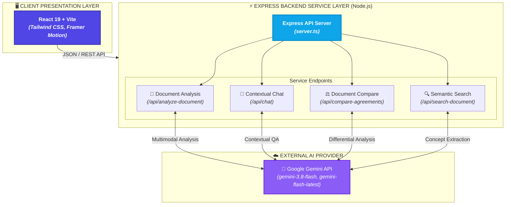

# 📜 AgreeEasy

> **Intelligent Agreement Analysis & Conversational Assistant powered by Gemini AI**

[](https://react.dev)
[](https://vitejs.dev/)
[](https://expressjs.com)
[](https://www.typescriptlang.org/)
[](https://tailwindcss.com)
[](https://ai.google.dev/)

---

AgreeEasy is an AI-powered agreement explainer designed to analyze complex legal documents (like NDAs, Rental Agreements, and Employment Contracts) and translate them into plain English. Built with a modern **React/Vite frontend** and a robust **Node.js/Express backend**, it utilizes the cutting-edge **Google Gemini API** for multimodal document analysis, allowing users to understand exactly what they are signing.

> **Disclaimer**: This application is not a lawyer and does not provide legal advice.

---

## 📋 Table of Contents

- [✨ Features](#-features)
- [🏗️ Architecture & Pipeline](#️-architecture--pipeline)
- [🛠️ Tech Stack](#️-tech-stack)
- [🔌 API Reference](#-api-reference)
- [💻 Local Development Setup](#-local-development-setup)
- [🚀 Deployment](#-deployment)
- [📝 License](#-license)

---

## ✨ Features

| Feature | Details |
|---|---|
| 🤖 **Automatic Document Detection** | Multimodal upload support (PDFs, Images, Text). Extracts parties, dates, intent, and governing laws automatically using Gemini. |
| 🚨 **5 Things You Should Know** | Instantly highlights the most critical risks, financial obligations, and restrictive clauses so you don't miss the fine print. |
| 🧩 **Structured Clause Breakdown** | Translates heavy legal jargon into simple bullet points. Evaluates user obligations vs. counterparty obligations. |
| 💬 **Conversational Chatbot** | Persistent contextual chat tailored to your uploaded agreement. Ask "What happens if..." scenarios directly to the document. |
| ⚖️ **Agreement Comparison** | Upload an original and a revised draft. The system automatically identifies added, removed, and modified clauses, outlining the practical impact. |
| 🔍 **Semantic Document Search** | Natural-language semantic search across the agreement (e.g. "Where does it talk about payment penalties?"). |
| 💡 **Questions & Negotiation** | Suggests critical questions you should ask the other party before signing and offers negotiation alternatives. |

---

## 🏗️ Architecture & Pipeline

### System Architecture



---

## 🛠️ Tech Stack

### Frontend
- **Framework**: React 19 + Vite
- **Styling**: Tailwind CSS v4
- **Icons**: Lucide React
- **Animations**: Motion (Framer)
- **Markdown Parsing**: React Markdown

### Backend
- **Server**: Node.js + Express
- **AI Integration**: `@google/genai` SDK
- **Language**: TypeScript (executed via `tsx` and bundled via `esbuild`)

---

## 🔌 API Reference

The backend (`server.ts`) exposes the following core endpoints:

| Endpoint | Method | Purpose |
|---|---|---|
| `/api/analyze-document` | `POST` | Analyzes a document (Base64 file or text) and returns a massive structured JSON breakdown of clauses, risks, and financial obligations. |
| `/api/chat` | `POST` | Processes user questions regarding an uploaded agreement. Uses conversation history and document context to prevent hallucinations. |
| `/api/explain-clause` | `POST` | Re-explains a specific clause in user-selectable styles (e.g., "explain_like_15", "consequence", "detailed"). |
| `/api/search-document` | `POST` | Natural-language search across the agreement returning relevant excerpts and explanations. |
| `/api/compare-agreements` | `POST` | Compares two agreements (Original vs Revised) and returns a differential summary of altered obligations and payments. |

---

## 💻 Local Development Setup

1. **Clone the repository** (or open the project folder in your IDE).
2. **Install Dependencies:**
   This project uses Bun, but `npm` works perfectly as well.
   ```bash
   npm install
   # or
   bun install
   ```
3. **Set Up Environment Variables:**
   Copy the provided `.env.example` to `.env` and insert your Gemini API Key.
   ```bash
   cp .env.example .env
   ```
   *Edit `.env` to include:*
   ```env
   GEMINI_API_KEY="your_actual_api_key_here"
   ```
4. **Start the Development Server:**
   ```bash
   npm run dev
   # or
   bun run dev
   ```
   *The server runs locally (usually at `http://localhost:3000` or `http://localhost:5173`). Vite HMR is enabled out of the box.*

---

## 🚀 Deployment

Because AgreeEasy utilizes a custom Express server alongside a React frontend, it is best suited for environments that support Node.js containers:

- **Google Cloud Run** (Recommended for scale)
- **Render / Railway / Heroku** (Great for quick deployments)

*Note: Deploying directly to static site hosts (like default Vercel or Netlify) requires migrating the Express routes into Serverless Functions.*

---

## 📝 License

This project is intended for demonstration and educational purposes during hackathons. Always consult a legal professional before signing binding agreements.
